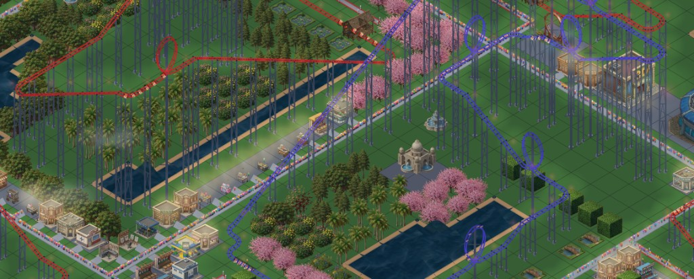

# IsoCity & IsoCoaster

Open-source isometric simulation games built with **Next.js**, **TypeScript**, and **HTML5 Canvas**.

| IsoCity | IsoCoaster |
|---------|------------|
|  |  |
| City builder with trains, planes, cars, and pedestrians | Theme park builder with roller coasters, rides, and guests |
| [iso-city.com](https://iso-city.com) | [iso-coaster.com](https://iso-coaster.com) |

Made with [Cursor](https://cursor.com)

## Features

-   **Isometric Rendering Engine**: Custom-built rendering system using HTML5 Canvas (`CanvasIsometricGrid`) capable of handling complex depth sorting, layer management, and both image and drawn sprites.
-   **Dynamic Simulation**:
    -   **Traffic System**: Autonomous vehicles including cars, trains, and aircraft (planes/seaplanes).
    -   **Pedestrian System**: Pathfinding and crowd simulation for city inhabitants.
    -   **Economy & Resources**: Resource management, zoning (Residential, Commercial, Industrial), and city growth logic.
-   **Interactive Grid**: Tile-based placement system for buildings, roads, parks, and utilities.
-   **State Management**: Save/Load functionality for multiple cities.
-   **Responsive Design**: Mobile-friendly interface with specialized touch controls and toolbars.

## Tech Stack

-   **Framework**: [Next.js 16](https://nextjs.org/)
-   **Language**: [TypeScript](https://www.typescriptlang.org/)
-   **Graphics**: HTML5 Canvas API (No external game engine libraries; pure native implementation).
-   **Icons**: Lucide React.

## Getting Started

### Prerequisites

-   Node.js (v18 or higher)
-   npm or yarn

### Installation

1.  **Clone the repository:**
    ```bash
    git clone https://github.com/amilich/isometric-city.git
    cd isometric-city
    ```

2.  **Install dependencies:**
    ```bash
    npm install
    ```

3.  **Run the development server:**
    ```bash
    npm run dev
    ```

4.  **Open the game:**
    Visit [http://localhost:3000](http://localhost:3000) in your browser.

## Contributing

Contributions are welcome! Whether it's reporting a bug, proposing a new feature, or submitting a pull request, your input is valued.

Please ensure your code follows the existing style and conventions.

## License

Distributed under the MIT License. See `LICENSE` for more information.
